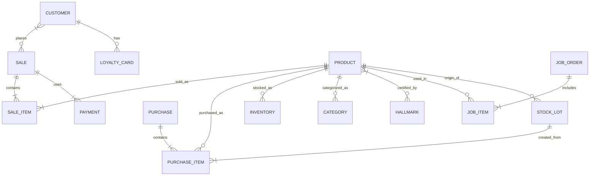
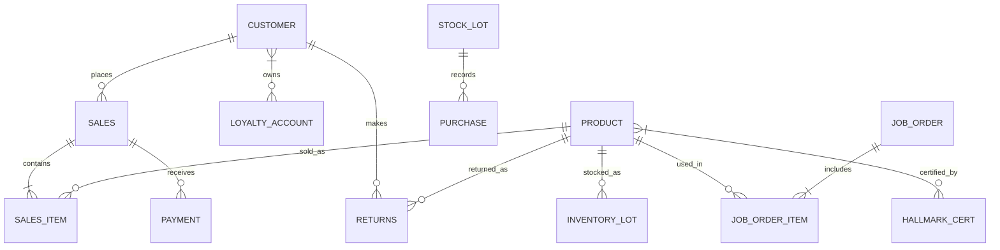

# Jewelry/Gold Shop ERP Module (India & Saudi Arabia)

## Executive Summary  
Designing a jewelry/gold retail module for an ERP in Node.js requires addressing distinct regulatory, operational, and localization needs in both India and Saudi Arabia. India mandates BIS hallmarking of gold (with a 6-digit HUID code) and levies a uniform 3% GST on jewelry sales【4†L26-L34】【14†L100-L107】. Saudi law likewise requires official hallmarks on precious metals【25†L135-L143】 and applies 15% VAT to jewelry of <99% purity【18†L73-L81】 (0% on investment-grade gold ≥99%). Both markets require detailed, tax-compliant invoicing (HSN 7113 for gold articles, with purity and hallmark info【23†L314-L319】【25†L150-L156】). 

Key business workflows include an integrated POS (with offline modes, scale/scanner integration, and quick billing) and comprehensive customer/loyalty management. Functions like buyback/trade-in, repair/custom orders, and stone/wastage tracking are essential. Inventory must be weight-based and multi-unit (grams, tola, etc.), tracking lots, alloys, gemstones, hallmark IDs, and serial numbers【30†L332-L337】【31†L92-L100】. Pricing must factor in dynamic gold rates (via real-time feeds), making and labor charges, wastage allowances, and stone valuations, with currency conversion between INR and SAR as needed. 

The module should seamlessly post to accounting (automatically creating tax ledgers, COGS entries, and revenue journals) and support reporting/audit trails for compliance and loss prevention. Localization entails multi-currency, multilingual UI (English/Arabic/Hindi), local date formats (e.g. Hijri calendar support in Saudi), and proper unit conversions. 

We recommend a Node.js stack (Express/Nest.js) with a relational DB (Postgres) plus Redis for caching and Elasticsearch for search. Gold prices can be pulled from a trusted API (LBMA or RBI rates) and refreshed regularly. Key API endpoints would cover products, inventory, customers, orders, loyalty, and real-time events (e.g. `SALE_CREATED`, `GOLD_RATE_UPDATED`). Security must include role-based access, data encryption, and audit logging. 

Implementation should be phased: Core (inventory, POS, invoicing) first, then loyalty and loyalty rules, followed by advanced workflows (buyback/exchange, repairs), with milestones for multi-currency support, localization, and integrations. Each milestone is assessed for effort (L/M/H) and risks (e.g. data accuracy, regulatory changes) with mitigation (extensive testing, compliance reviews). 

Below we detail regulations, workflows, data and API designs, and more. 

## Regulatory & Tax Requirements

### India (Regulatory & Tax)  
- **Hallmarking/Purity:** BIS Hallmarking is mandatory for gold jewelry. Gold items must display (1) the BIS logo, (2) purity in carats (e.g. 22K, fineness), and (3) a 6-character Hallmark Unique ID (HUID)【4†L26-L34】. From April 1, 2023, BIS-registered jewelers may *only* sell HUID-hallmarked jewelry【4†L96-L100】. For example, “22K” gold items should be tested by accredited centers; the HUID can be verified by consumers via the BIS app. Items without HUID (or not yet hallmarked as per BIS order) cannot be sold legally. 

- **GST on Jewelry:** The GST rate on gold jewelry (and silver jewelry) is a flat **3% of the transaction value**, regardless of how making charges are billed【14†L100-L107】. (In practice, CGST 1.5% + SGST 1.5% apply in intra-state sales.) Making charges *do not* carry a separate 5% GST; instead the entire sale is taxed at 3%【14†L100-L107】. Buyers should receive a GST-compliant invoice with HSN codes (e.g. 7113) and GSTIN numbers. Input tax credit rules apply; customers in the business can claim credit on qualifying inputs.

- **Invoicing & Compliance:** Invoices must include GSTIN, HSN code (e.g. 7113 for gold jewelry), item details (weight, purity/karat, making charges), and tax breakup. Credit notes are issued for canceled sales/returns under GST rules. E-invoicing may be required if turnover is above the statutory threshold. All sales are recorded for GST return filing. Jewelry-specific rules (like GST on exchange/gold buying) follow general GST law (e.g. reverse charge on scrap purchases if any【8†L0-L3】).

- **Returns/Exchange:** Consumers often return or exchange jewelry. The ERP must handle *exchange transactions* (trade-in old gold for new) and *buyback* (vendor repurchases old jewelry). For accounting, these are sales to the customer and purchases from the customer simultaneously. The software must adjust inventory and issue proper tax documents (e.g. a new sale invoice plus a vendor bill for the old item). Scrap metal purchases from customers are charged at GST 3% under reverse charge (per CBIC)【8†L0-L3】, and customers get C-form credit. 

### Saudi Arabia (Regulatory & Tax)  
- **Hallmarking/Purity:** Saudi’s Precious Metals & Gemstones Law mandates official hallmarking of all precious metal products【25†L135-L143】. Imported jewelry must carry a **SASO-approved hallmark certificate** verifying purity and origin【23†L314-L319】. Local refiners or importers must ensure pieces are tested by accredited labs and marked accordingly (similar to BIS in India). Invoices and labeling must state fineness (e.g. 18K) and hallmark information【25†L150-L156】.

- **VAT on Gold/Jewelry:** Saudi VAT is **15%** on consumer goods, including jewelry (even 24K items), and **0%** on investment-grade gold (≥99% purity in bars/coins)【18†L73-L81】【16†L105-L114】. This means all gold jewelry sales are taxed at 15% of the total value. VAT-registered sellers must charge and remit 15% VAT on every sale of jewelry (lesser purity)【18†L79-L81】. Imported gold jewelry incurs customs duty (if any) and VAT on clearance. The ERP must clearly compute SAR 15% on invoice totals; itemizing tax base and VAT amount.

- **Invoicing & Compliance:** Invoices must comply with ZATCA requirements: showing seller’s VAT registration, invoice date, customer details, item description (including karat, gemstones, treatments), weight, and VAT amount. As per regulations, invoices should detail metal purity and any gemstone information【25†L150-L156】. The system should support bilingual (English/Arabic) invoices. Anti-fraud: authorities require digital records of all sales; audit trails must be maintained (Saudi law requires records for several years【25†L125-L133】). Penalties apply for non-compliance (e.g. fines for un-hallmarked gold, undervaluation).

- **HS Codes & Customs:** Customs HS code for gold jewelry is typically 7113.19.00【23†L300-L303】. Imported jewelry requires certificates (origin, hallmark, assay) and value declaration. Internally, we track HSN 7113 (India) and matching codes (Saudi extension) for tax returns and analytics.

## Business Workflows

### POS & Billing  
- **Point-of-Sale:** A fast, user-friendly POS is critical. It should allow sales associates to quickly select products (by barcode, SKU, or weight), adjust making charges, apply discounts/loyalty points, and complete transactions with multiple payment modes (cash, credit cards, digital wallets). The POS must integrate with hardware: barcode scanner, cash drawer, customer display, and jewelry scales (serial/USB connection to weigh gold/stone in real time). For example, entering an item weight on the scale would auto-calculate price. The POS must print tax-compliant invoices/receipts (with logo, HUID/karat, GSTIN or VAT reg. no., etc.) and possibly SMS/email e-receipts. 

- **Offline Mode:** For reliability, support offline transaction caching (sync later) to handle network outages. 

- **Tax Calculations:** As noted, all gold items are taxed at 3% (India) or 15% (KSA) of the total; the system should compute GST/VAT and auto-add to invoices【14†L100-L107】【18†L73-L81】. It should support state-specific tax (IGST/CGST/SGST splitting in India). RCM (reverse charge) can be flagged when purchasing scrap. 

- **Billing & Returns:** Generate bills/invoices via the POS. For returns/exchanges, allow either negative sales or separate “buyback” receipts. Track reasons, restock value, and tax adjustments. For warranty/repairs, issue service receipts.

### Customer Management & Loyalty  
- **CRM:** Maintain a customer database (with name, contact, purchase history, preferences). Track KYC details if required (some countries require ID for gold sales above certain limits). Provide customer loyalty programs: points accrual on purchases, tiers/discounts, promotional offers. Integration with billing: POS can redeem points or print loyalty coupons. Capture customer feedback and preferences. 

- **Marketing:** The ERP can schedule reminders (e.g. anniversaries, maintenance) and campaigns (SMS/email offers). Loyalty balances should appear on invoices/receipts. 

### Buyback & Exchange  
- **Gold Exchange:** Many jewelers offer schemes where customers can exchange old gold for new designs. The module should handle “gold-for-gold” exchange transactions: take in the old item (valuation by live gold rate) and offset its value against the new sale. The net invoice shows sale of new item minus trade-in value. Each exchange should be documented (photo/appraisal of old piece, purity confirmation) and inventory updated (old item may go to scrap or reuse). 

- **Gold Buyback:** Buying scrap from customers is common. The ERP should process a purchase order for old gold, applying the current gold buying rate (with a spread) and tax (GST/VAT on purchase as per law). This creates stock of raw gold (for melting or resale). For buyback, a purchase receipt (tax invoice) is issued to customer; the cost of goods and tax postings are handled accordingly.

### Repair/Service & Custom Orders  
- **Job Orders:** Jewelry often goes into the workshop for resizing, repairs, or custom crafting. The system should allow creating a “job card” when a customer leaves a piece. Record item details, requested work, expected completion date, and cost estimate. Track status (in progress, completed). On delivery, generate service invoice. 

- **Workshop Tracking:** Manage production flows: e.g. design → CAD modeling → casting → stone setting → QC. Record material consumption (gold, stones, labor hours). Link any wastage (metal leftover) back to inventory. For custom orders, track approvals and partial payments. 

ChainDrive highlights that ERP must handle *serialized items, appraisals, repairs, and custom jobs* natively【31†L92-L100】. All in all, the system should unify the retail front-end with the back-end workshop, so inventory used in jobs is deducted and costs captured for COGS analysis.

### Wastage & Stone Management  
- **Wastage Tracking:** In jewelry manufacturing, “wastage” (weight loss during crafting) is often charged to customers or allowed. The ERP can calculate wastage allowances (as % of gross weight) and factor into pricing or billing. It should track actual scrap produced and re-melted. 

- **Stone Inventory:** Maintain a catalog of gemstones (type, carat, clarity, supplier, cost). When a piece is sold with stones, those are deducted from inventory. Likewise, reclaimed stones from repairs return to stock. The ERP should manage multi-unit (pieces, carats) inventory for gems and custom pricing per stone (e.g. diamond per carat at market rate). Auric notes full support for “stone tracking” and multi-unit weights【30†L332-L337】.

- **Alloy Composition:** If the business mixes metals (e.g. 14K alloy from 24K gold), track compositions at the product or batch level, to accurately compute intrinsic value.

### Other Workflows  
- **Reporting & Audits:** Build audit logs of all transactions (user, timestamp, changes). Provide regulatory reports: daily sales summaries, GST/VAT returns, BIS monthly hallmarking reports (if any), and inventory audits.  

- **Inventory Counting:** Periodic physical stock-takes or “tray counts” can be supported with mobile devices or tablets, scanning items or weighing batches. Discrepancies (shrinkage/loss) are flagged.

- **Security Checks:** For high-value operations, add cashier logins, PINs for discount/void overrides, and perhaps a dual-approval for large transactions. 

## Inventory Model

- **Product Entities:** The data model should distinguish *raw materials* (gold bars, blank sheets, loose stones) from *finished products* (jewelry pieces). Each product record should include fields for weight, purity (karat), metal type, gemstone details, unique serial numbers (for high-value items), and hallmark ID if applicable. For example, an entry “Gold Necklace #123” could have gross weight 50g, 22K, net gold 48g (accounting for attached stones), HUID, and certificate details.

- **Lots & Batches:** For purchased gold or stones, track batch/lot numbers (to trace quality or origin) and acquisition cost. E.g. “Gold Lot 2026-05” with 1kg at Rs. XYZ. Inventory records use these lot IDs to maintain FIFO valuation.

- **Weight-Based Stock:** Unlike retail goods, stock is measured in weight. The ERP must handle both gross and net weight fields. Products may be defined per piece, but often inventory is managed as *quantity in grams*. Some elements (beads, stones) use piece count.

- **Alloy Composition:** If an item is 18K (75% gold), the system could internally record its fineness; costing should account proportionally.

- **Hallmarked Items:** Store hallmark details (BIS HUID or SASO certification) in the product record. Hallmarked inventory may require special flags. Unsold stock intended for hallmarking can be tracked until certified.

- **Serialized Items:** Unique high-value pieces (e.g. diamond rings) should get serials/IDs. The ERP should allow scanning or entering serial on sale to prevent theft. ChainDrive emphasizes *serialized tracking* of diamonds, gemstones, etc.【31†L144-L152】.

Below is a conceptual data model (ER diagram) illustrating key entities:

*(Legend: SALE = invoice/sale order, PURCHASE = vendor purchase/return, JOB_ORDER = repair/custom work order, LOYALTY_CARD = customer loyalty account.)*

## Pricing Rules

- **Gold Rate Feeds:** Implement a service to fetch live gold prices (e.g. from LBMA, RBI, or commodity APIs) in INR and SAR. Store daily rates for 24K gold; calculate equivalent for other purities. Use currency rates (RBI and SAMA publish forex rates) for INR↔SAR conversion. Update rates periodically (e.g. hourly or daily). Sales prices of items should auto-adjust with the latest rates.

- **Making/Labor Charges:** Typically, jewelry pricing is *gold value + making charge*. Define making charge either as a fixed ₹/g (or SAR/g) or as a percentage markup. Optionally, configure different labor rates by product type or size. On invoice, show making separately if required. Even if it’s not taxed separately, the system can record it as a line item for costing.

- **Wastage Allowance:** Some jewelers charge a fixed % wastage over gross weight (to cover material lost). The ERP can include a wastage factor per product; e.g. 5% extra weight cost. This can be auto-calculated and added to net weight for costing.

- **Stone Valuation:** Store cost/pricing of gems in database. For appraisal or custom cutting, allow per-carat pricing. On an item, total stone value = sum(each stone carat × rate). The ERP should aggregate this with metal cost. 

- **Dynamic Pricing Logic:** Pricing rules (carat rate + making + wastage + stone cost) can be codified. The system may support price adjustment events: e.g. if gold moves beyond threshold, prompt repricing of inventory or automatically update base rates. Multi-currency support ensures, for example, that an item priced in USD or SAR can display converted price in INR (using current FX).

## Accounting & Finance Integration

- **Tax Ledgers:** Sales should post automatically to VAT/GST output tax ledgers (e.g. “GST Collected @3%” in India, “VAT Collected @15%” in KSA). Purchase of raw materials posts to input tax ledgers. The ERP should generate tax return data (GSTR-1, GSTR-3B in India; ZATCA VAT returns in Saudi).

- **Revenue & COGS Recognition:** On invoicing, record revenue (sales) and remove inventory cost (COGS). Jewelry’s COGS is typically the sum of metal and stone costs (including waste and making, if capitalized). The system should support multiple costing methods (FIFO, average cost) given market fluctuations. For returns/exchanges, do corresponding reverse entries.

- **Accounts Payable/Receivable:** Integrate with general ledger for customer AR and vendor AP. Receipts and payments (bank/cash) should reconcile with sales/purchase records. If E-invoicing is used (India) or E-way bills, link invoice numbers accordingly.

- **Audit Trail:** Every financial transaction (sale, purchase, adjustment) should be logged with user, timestamp, and relevant details. This ensures compliance and aids in audits. For example, if a BIS hallmark is requested for a piece, a record of the request and result is kept.

- **Reports:** Provide standard and custom reports: daily sales, tax summaries, inventory valuation, profitability by item or category, loyalty balances, etc. Audit logs can be exported for regulators. Altogether, the module should make financial statements “audit-ready” as promised by specialized ERP offerings【30†L389-L397】.

## Localization Needs

- **Currency & Units:** In India, the default currency is INR (₹) and weight often in grams or tolas (1 tola ≈ 11.66g). In Saudi, currency is SAR (¥) and weight in grams. The ERP should support multi-currency for reporting, and allow price entry/display in both (with conversion). Measurements: allow configuring default units and convert automatically (e.g. an item can show 10g (0.857 tola)). 

- **Language:** The UI and documents should support English, Hindi, and Arabic locales. In India, invoices can be in English (and possibly Hindi) to suit customer preference. In Saudi, a bilingual English/Arabic invoice is prudent (show Arabic script for item, VAT, etc.). Right-to-left layout must be supported for Arabic interfaces and printouts. All labels (e.g. “Gold”, “Ring”, “Total”) should be translatable via resource files.

- **Date/Time:** India uses dd-mm-yyyy and 24h clock, Saudi commonly uses dd/mm/yyyy (Gregorian) and may also refer to Hijri calendar dates. Allow date formatting per locale. Time zone (IST vs AST) differences should be handled by server and UI.

- **Legal Documents:** Invoice templates must include legally required info. In India: GSTIN, “Tax Invoice” header, HSN codes, terms. In Saudi: VAT reg. no. (TIN), Arabic translations (“فاتورة ضريبية”), and possibly mention of Zakat deductions if relevant. Also, specifics like “Net Weight”, “Purity” should appear on receipts【25†L150-L156】. The ERP should allow customizing templates per country.

- **Measurement Systems:** Use metric by default, but some users in India may still think in tolas. Provide option to enter/display in tolas. For diamonds/stones, carats (ct) or pieces.

- **Regulatory Adaptations:** Stay alert to changes: e.g. if KSA law changes hallmark symbol or inspection fees. Assume we will update the configuration (hallmark mark images, tax rates, etc.) without code changes where possible.

## Functional & Non-Functional Requirements

**Functional Requirements:** 
- Multi-branch support (if retailer has multiple stores).
- Real-time inventory sync between stores.
- Role-based user accounts (admin, cashier, accountant, workshop).
- POS with offline capability and hardware integration (scales, printers, scanners).
- Inventory management by weight, grade, batch, and serial number.
- Support for hallmark tracking and certification process.
- Customer database with loyalty program.
- Sales, returns, exchanges, buyback workflows.
- Repair/Job order processing.
- Pricing engine (gold rate feeds, making charges, wastage).
- Multi-currency transactions and multi-language UI.
- Tax compliance: automated GST/VAT calculation and return data export.
- Integration APIs/webhooks (e.g. for real-time gold price updates, external accounting).
- Reporting: sales, tax, inventory, audits.

**Non-Functional Requirements:** 
- Scalability: Handle high transaction volume (e.g. 1000+ sales/day).
- Performance: POS actions in <2s, search results quick.
- Reliability/Availability: 99.9% uptime (especially for POS), offline modes.
- Security: TLS/HTTPS, encrypted sensitive data, regular backups.
- Usability: Intuitive UI for fast operation; responsive design if using tablets.
- Maintainability: Modular code, use of frameworks (e.g. NestJS) for clean architecture.
- Localization: Easily add languages; configure currency formats per region.
- Extensibility: Plug-in support for future modules (e.g. an online store).
- Compliance: Adhere to GDPR (if EU customers), local data protection.

## Data Model Suggestions  

A simplified entity-relationship (ER) model for the jewelry module might include: Customers, Products, Sales (Invoices), Purchases (from vendors/customers), Inventory Lots, Job Orders, and Loyalty. Below is an illustrative Mermaid ER diagram:

*(Each entity like SALES, PURCHASE, JOB_ORDER has attributes such as date, totals, references to customers or suppliers. HALLMARK_CERT would store cert ID, purity, issuing lab.)*

## API Endpoints & Events (Node.js Integration)

Design the ERP as RESTful (or GraphQL) services in Node.js. Example endpoints:

- **Customers:** `GET/POST/PUT /api/customers`
- **Products/Inventory:** `GET/POST /api/products`, `GET/POST /api/inventory-lots`
- **Sales/Invoices:** `POST /api/sales` (create invoice), `GET /api/sales/:id`, `POST /api/returns` (process returns/exchange)
- **Job Orders:** `POST /api/job-orders`, `PUT /api/job-orders/:id` (update status)
- **Pricing:** `GET /api/gold-price` (returns latest rate), or push to clients.
- **Loyalty:** `GET/POST /api/loyalty/points`
- **Currency:** `GET /api/currencies/rates` (pulls FX rates)

Events via WebSockets or message broker (Kafka/RabbitMQ) can notify connected POS terminals: e.g. `PRICE_UPDATE` (broadcast new gold rates), `INVENTORY_CHANGED`, `SALE_COMPLETED`, etc. This enables real-time UI refresh. Use JSON Webhooks for external integration (e.g. call accounting system when a sale is recorded).

Authentication (JWT) and role-based authorization should protect APIs. Audit-logging middleware can tag each request.

## Recommended Tech Stack & Components

- **Backend:** Node.js with NestJS or Express; TypeScript for type safety. 
- **Database:** Relational (e.g. PostgreSQL or MySQL) to ensure ACID for financials. Use an ORM (TypeORM/Sequelize) for models. Alternatively, a hybrid approach: MongoDB for unstructured logs, but RDBMS for core data is safer.
- **Cache:** Redis for sessions, caching frequently-used data (e.g. stock queries, rate lookups), and for queuing tasks (e.g. invoice PDF generation).
- **Search:** Elasticsearch for fast product search by name, karat, or attributes across large catalogs.
- **Gold Price Feed:** Cron job or external script using a reliable API (e.g. LBMA, metals-API, or central bank rates) to update daily prices and FX. Expose via a secured internal endpoint.
- **External Integrations:** Payment gateway SDKs (credit card terminal), and hardware drivers. Use Node libraries for printers (ESC/POS) and scale integration (e.g. via serialport or USB) to fetch weight.
- **POS Hardware:** Standard thermal receipt printers, cash drawers, barcode scanners (via HID). For jewelry scales, either USB-serial scales (read via serialport in Node) or networked scales.
- **Frontend:** A responsive web app (React/Vue/Angular) or Electron for a desktop POS. Use component libraries that support RTL (for Arabic). For admin, a rich web dashboard.
- **Deployment:** Docker containers orchestrated by Kubernetes or a PaaS (AWS EKS/Elastic Beanstalk). Use CI/CD pipelines (GitHub Actions/Bitbucket Pipelines) for testing and deployment. Store sensitive config (API keys) in environment vars or secrets (Vault).
- **Monitoring:** Logging (ELK stack), and monitoring (Prometheus/Grafana) for uptime and performance.
- **Compliance:** Ensure TLS on all endpoints; consider token vault for API secrets. Comply with local data laws (store customer data on local servers if required by law).

## Security, Testing & Deployment

- **Security:** Enforce HTTPS; hash passwords (bcrypt) for user accounts. Implement strict RBAC: e.g. cashiers can’t modify prices; managers can. Encrypt sensitive fields (like cert codes). Follow OWASP best practices (e.g. input sanitization to prevent injections, CSRF tokens). Regular security audits and pen-testing are recommended, given the high value of inventory. Log out inactive sessions.
- **Data Protection:** Backup database nightly, with offsite replication. In Saudi, ensure backups follow any data residency rules. Optionally, integrate with antivirus on file uploads (if customer images or attachments).
- **Testing:** Use automated testing. Unit tests (Mocha/Jest), API integration tests (Supertest), and end-to-end tests (Cypress or Selenium for UI). Mock integrations (payment terminal, scale). Validate tax logic with scenarios. Conduct performance testing on POS under load. 
- **Deployment:** Stage deployments (Dev → QA → Prod) with migration scripts (using tools like Flyway for DB schema). Use feature toggles for risky new features. Ideally, have a rollback plan. 
- **Compliance Updates:** Build a framework to update tax rates or hallmark rules without full redeploy (e.g. config tables or microservices).

## UI/UX Considerations

- **POS Screen:** Large buttons for products and actions; numeric keypad for weight. Clearly display real-time gold rate, item wt, karat, and totals. Provide a quick search by product code. For Arabic interface, mirror layout and ensure fonts support Arabic script. Show loyalty info/points prominently.
- **Error Prevention:** On POS, warn if entering weight beyond stock or negative values. Confirm if employee tries to override price or discount.
- **Admin Dashboard:** Tabbed interfaces for inventory, customers, and reports. Data visualization for stock by karat, sales trends. Include audit logs and alerts (e.g. “low stock”, “rate change applied”).
- **Localization:** All labels/tooltips must be translatable. Date/time pickers and number formats should adapt per language. Right-to-left support for Arabic UI.
- **Accessibility:** Use high-contrast design (jewelry shops often have varied lighting). Support keyboard shortcuts (for speed). 

## Migration Strategy

- **Data Import:** Define a CSV or Excel template for existing inventory/customers. Include fields: item name, weight, purity, alloy details, hallmarks, cost. Build import scripts with validation (e.g. total weight must equal sum of components). For legacy sales history, decide whether to import or start fresh (often start fresh, archive old data).
- **Cutover Plan:** Run old and new systems in parallel (dual entry) for 1-2 weeks to reconcile. Train staff on new POS before go-live. Migrate opening stock values carefully (using the gold rate on cutover date).
- **Inventory Reconciliation:** Perform a physical audit post-import to ensure system quantities match reality. Adjust as needed.
- **Assumptions:** We assume moderate transaction volume (e.g. 50–200 sales/day per store). If volume is much higher, scale resources accordingly. We also assume existing ERP architecture can integrate via APIs or middleware.

## Implementation Roadmap

1. **Phase 1: Core Sales & Inventory (Effort: High)** – Develop the inventory model, product catalog (with karat, weight, hallmarks), POS checkout (item scan, weighing, billing), and basic invoicing with tax. Integrate dynamic gold rate feed. **Risks:** Inventory inaccuracies, rate feed delays. *Mitigation:* Build reconciliation tools, cache prices.
2. **Phase 2: Accounting & Tax Compliance (Effort: Medium)** – Hook into general ledger and tax returns. Implement 3% GST and 15% VAT logic. Generate statutory reports (GST returns, ZATCA VAT reports). **Risks:** Tax rule changes. *Mitigation:* Isolate tax rate/config in admin for easy updates.
3. **Phase 3: Customer & Loyalty (Effort: Medium)** – Build customer database, loyalty points, and basic CRM. Enable offers and purchase history tracking. **Risks:** Data entry quality. *Mitigation:* Mandatory unique IDs (e.g. phone or email) to avoid duplicates.
4. **Phase 4: Advanced Workflows (Effort: High)** – Add buyback/exchange, job orders (repair/custom), and wastage tracking. Integrate workshop scheduling. **Risks:** Complex accounting treatment for exchanges. *Mitigation:* Thorough testing scenarios; clear UI flows.
5. **Phase 5: Localization & Scaling (Effort: Medium)** – Add Hindi and Arabic UI translations, multi-currency toggles. Deploy multi-server architecture for redundancy. **Risks:** UI/RTL issues. *Mitigation:* Engage native speakers in UAT.
6. **Phase 6: UX Enhancements & Hardware (Effort: Low)** – Polish UI, optimize performance, integrate with printers/scanners/scales. Provide mobile app or tablet interface if needed. **Risks:** Hardware compatibility. *Mitigation:* Early testing with devices; choose widely-supported models.
7. **Phase 7: Reports & Analytics (Effort: Low)** – Implement dashboards, alerts (e.g. low stock warning), and custom reports (e.g. bis monitoring, jewel appraisal logs). 

Each milestone should be paired with training sessions and user acceptance testing. Risks like staff adoption or regulatory audits should be managed via phased rollout and using feedback loops.

## India vs Saudi Feature Comparison

| **Feature**             | **India Edition**                                 | **Saudi Edition**                                   |
|-------------------------|---------------------------------------------------|-----------------------------------------------------|
| **Legal Tax Rate**      | 3% GST on jewellery (total value)【14†L100-L107】  | 15% VAT on jewellery (consumer gold)【18†L73-L81】   |
| **Hallmarking**         | BIS mandatory (BIS mark + carat + 6-digit HUID)【4†L26-L34】 | SASO mandatory hallmark certificate (purity/origin)【25†L135-L143】【23†L314-L319】 |
| **Currency**            | INR (₹)                                            | SAR (¥), pegged to USD                              |
| **Units**               | Grams (and Tolas)                                  | Grams (metric)                                      |
| **Language**            | English/Hindi (UI/invoices)                        | English/Arabic (UI/invoices)                        |
| **Measurement Tools**   | BIS-certified scales recommended (mg precision)    | SASO-certified scales (annual verification)【20†L51-L59】  |
| **Tax Invoice**         | Must include GSTIN, HSN, etc.                     | Must include VAT reg.no., SASO mark, Arabic labels |
| **Returns Policy**      | Standard GST rules (credit notes)                 | Standard VAT credit notes                           |
| **Local Compliance**    | E-invoicing (if turnover high), BIS reporting     | ZATCA e-invoicing (if applicable), SASO compliance  |
| **Wastage Handling**    | Often charged; track separately                   | Often absorbed; track per shop policy               |
| **Loyalty Programs**    | Points/discounts as per GST (loyalty not taxed)   | Points/discounts under VAT (loyalty not taxed)      |

## Sample Invoice Templates

**India – Tax Invoice (Example):**  

| Invoice No.:  INV-2026-001 | Date: 2026-03-15        | Customer: Mr. A Sharma      |
|---------------------------|-------------------------|----------------------------|
| **Item**       | **Wgt(g)** | **Karat** | **Rate (₹/g)** | **Making (₹)** | **Line Total (₹)** |
| Gold Necklace  | 50        | 22K      | 5,500         | 1,000         | 276,000             |
| *Subtotal*     |          |          |               |               | ₹276,000            |
| *GST (3%)*     |          |          |               |               | ₹8,280              |
| **Total**      |          |          |               |               | **₹284,280**        |

*(Includes BIS HUID on Necklace, GSTIN: 27AAAAA0000A1Z5, HSN 7113.91, Terms: 30 days)*  

**Saudi Arabia – VAT Invoice (Example):**  

| رقم الفاتورة (Inv.):  SA-INV-0001 | التاريخ (Date): 2026-03-15       | العميل (Customer): Mr. Khalid Al Saud |
|----------------------------------|----------------------------------|--------------------------------------|
| **المنتج (Item)** | **الوزن (g)** | **العيار (Karat)** | **سعر (SAR/g)** | **المجموع (SAR)** |
| خاتم ذهبي (Gold Ring) | 20           | 21K           | 215.00         | 4,300.00           |
| *Subtotal*            |              |               |                | 4,300.00           |
| *ضريبة القيمة (VAT 15%)* |        |               |                | 645.00             |
| **المجموع الكلي (Total)** |    |               |                | **4,945.00 SAR**   |

*(يشمل شهادة عيار 21 قيراط وختم SASO، VAT Reg. #310000000000003)*  

Both invoices illustrate inclusion of weight, purity, item breakdown, and tax. The Saudi invoice uses Arabic labels and shows VAT (ضريبة القيمة), while the Indian invoice shows GST.

**Sources:** Government and industry references (BIS, PIB, GST Council, ZATCA) were used for regulations【4†L26-L34】【14†L100-L107】【18†L73-L81】【25†L135-L143】. Industry ERP vendors document specialized features【30†L332-L337】【31†L92-L100】. Regulatory guidance on invoicing and hallmarking were cited from official releases and authoritative reports【25†L150-L156】【23†L314-L319】.